Name: Ke Chen, Abhinav Bannerjee

UT EID: kc35827, ab45393

```{r,message=FALSE,echo=FALSE}
source("../.Rprofile",echo=FALSE)
```

###General Steps


[RShiny App. Click Here!](https://ckckchen.shinyapps.io/DV_FinalProject)

```{r,message= FALSE,echo=FALSE,warning=FALSE}
source("../04 Shiny/ui.R",print.eval=FALSE,echo = TRUE)
```
```{r,message= FALSE,echo=FALSE,warning=FALSE}
source("../04 Shiny/server.R",print.eval=FALSE,echo = TRUE)
```


###Visualization
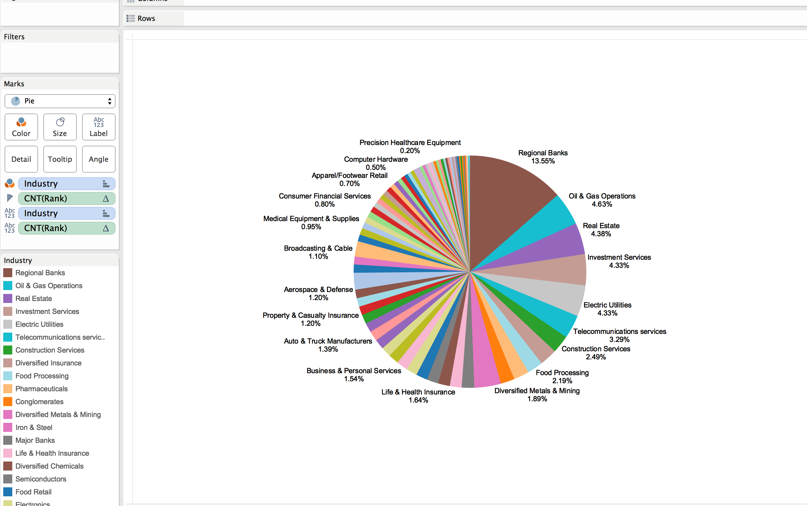 
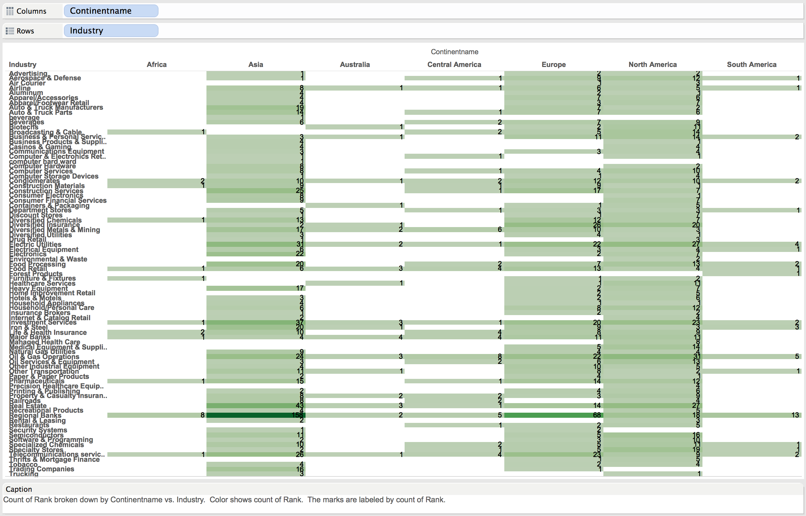 
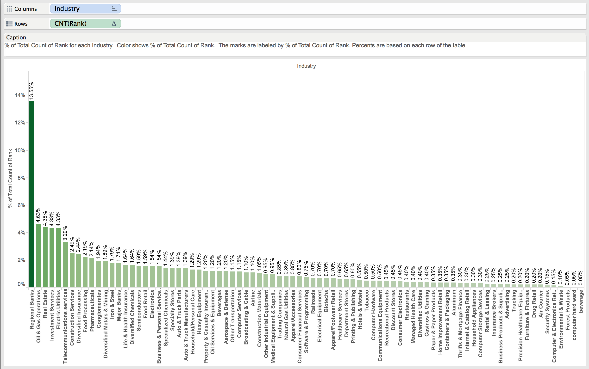 
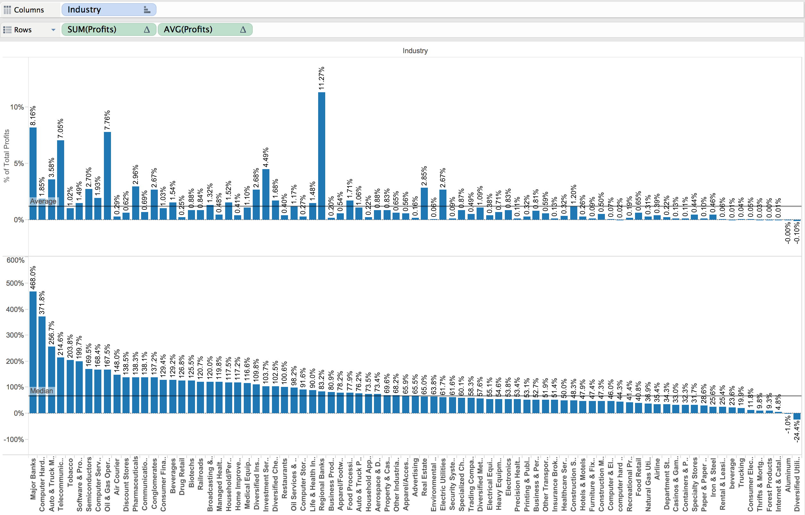 
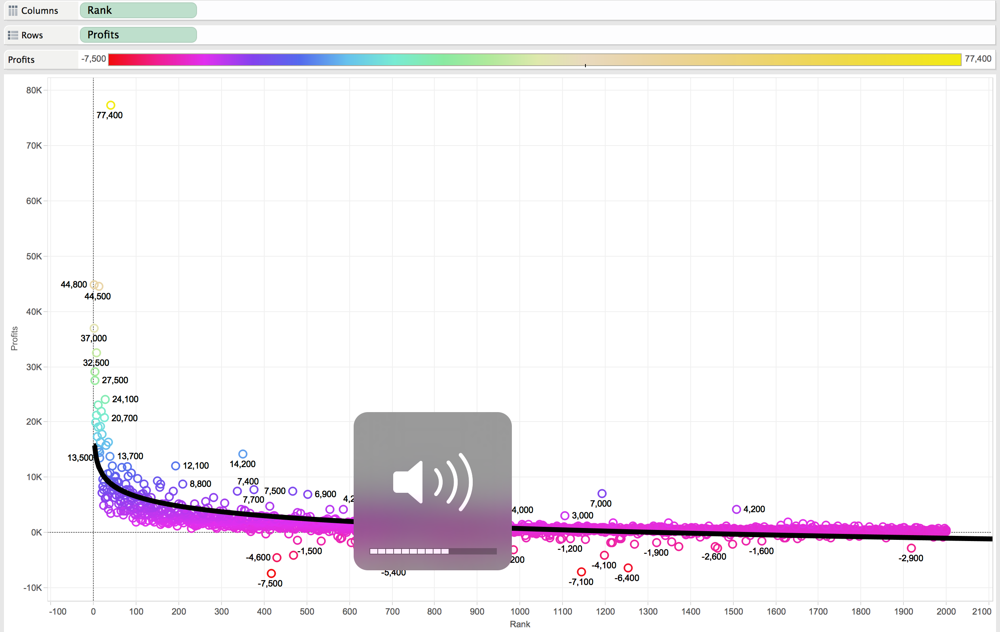 
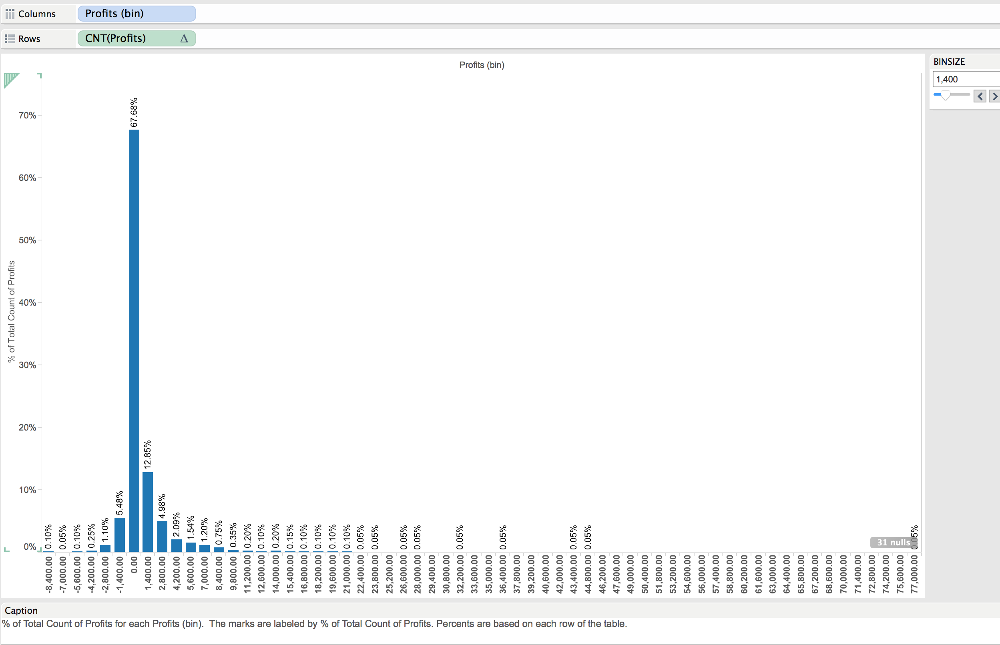 
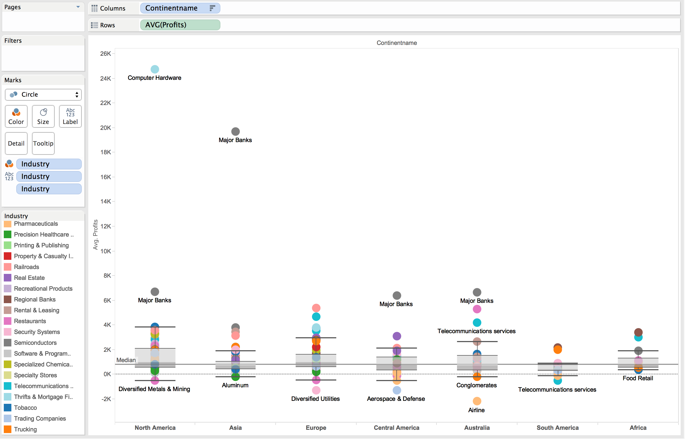 
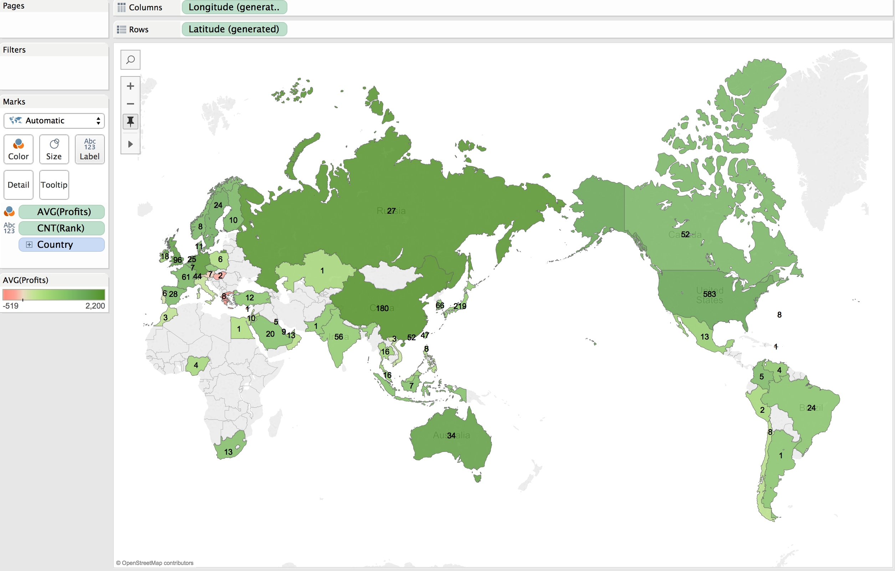 
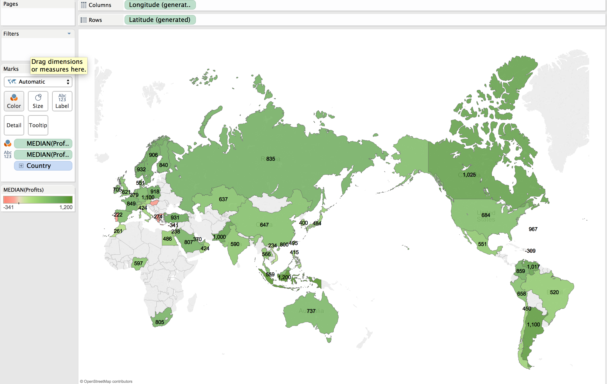 
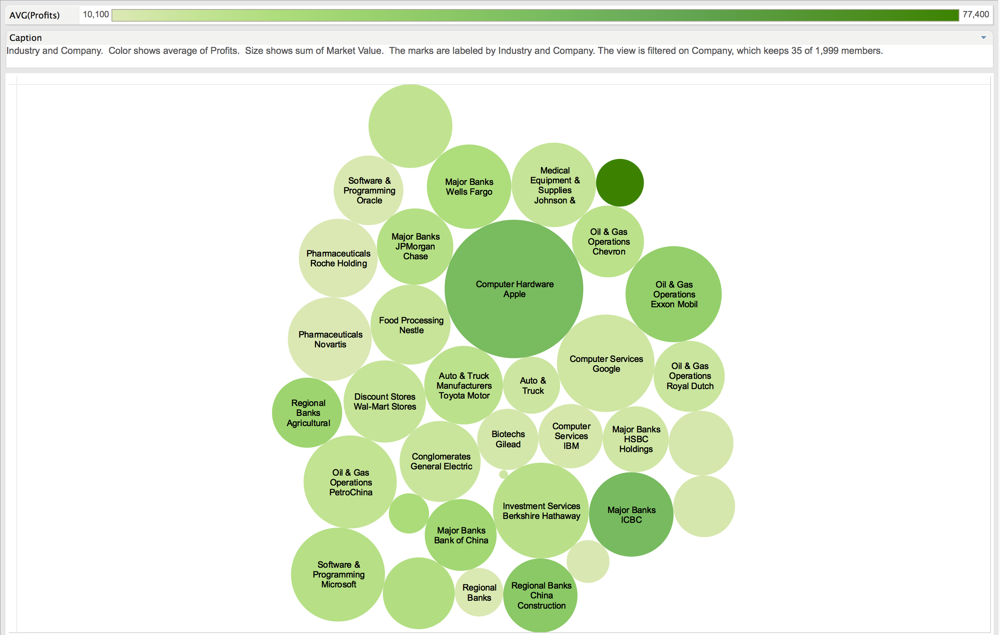 
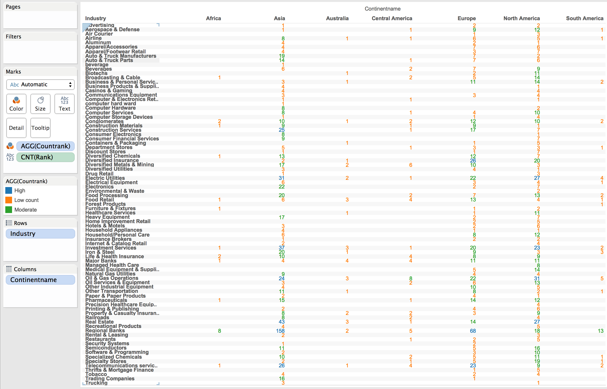 

