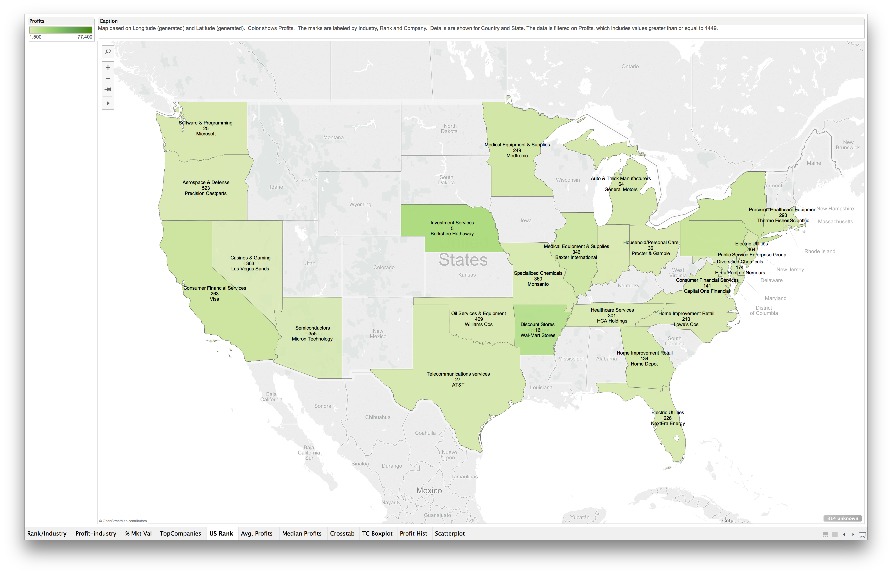

Name: Ke Chen, Abhinav Bannerjee

UT EID: kc35827, ab45393

```{r,message=FALSE,echo=FALSE}
source("../.Rprofile",echo=FALSE)
```

>##General Steps
1. Acquire data source (ours was Top 2000 Companies as ranked by Forbes)
2. Format data using ETL techniques for upload to Oracle SQL
3. Analyze data and prepare visualizations in Tableau and RStudio (using ggplot2 and other packages)
4. Create and publish Shiny web application with interactive visualizations

***********************************************************************

>###ETL Files
These are the two ETL files we used.
```{r,message= FALSE,warning=FALSE}
source("../01 Data/1_etl.R",print.eval=FALSE,echo = TRUE)
```

```{r,message= FALSE,warning=FALSE}
source("../01 Data/2_etl.R",print.eval=FALSE,echo = TRUE)
```
**************************************************************
>###Dataframes
Here are the code for us to query dataset from SQL.

The include the summary of the data and also the head of 20 companies in the world.(Ascending in Rank.)
```{r,message= FALSE,warning=FALSE}
source("../01 Data/DATAFRAME1.R",echo = TRUE)
```
As we can see in above. United States Japan, and China has the most of companies in the ranking list.And the profits' range start from 7.5 Billion defecit to 77.4 B Surplus.

Also,in the top 20 Companies, There are 9 financial related Companies, which is almost 50 % in the top 20. And These 9 comapnies include 6 major banks, 2 regional banks and 1 investment Services. Moreover, There are 4 Oil $ Gas companies, which is about 20 % in the top 20.
```{r,message= FALSE,warning=FALSE}
source("../01 Data/DATAFRAME2.R",echo = TRUE)
```
******************************************************************
>###Shiny
[RShiny App. Click Here!](https://ckckchen.shinyapps.io/DV_FinalProject)

*******************************************************************

The following two files are the code for Shiny.
```{r}
source("../04 Shiny/ui.R",echo = TRUE)
```

```{r}
source("../04 Shiny/server.R",echo = TRUE)
```
All shiny graph codes are included here. We use grammar of graph and Data wrangling to create these graphs.

***********************************************************************


>###Visualization
*********************************************************************
We Start our project by following the steps in Methodology.
We try to use different kind of Plots to discover interesting things.
We generate __Barchart__, __Crosstab__, __Histogram__,__Scatter Plot__,__Box Plot__,__Map__,__Pie Chart__ and __Bubble__ to find some interesting facts.


**********************************************************************

__Barchart allows us to see which industries take up most of the ranks__


**********************************************************************


__Crosstab displays number of ranked companies in every continent based on industry__
 

**********************************************************************

__This is a breakdown of % total profits and % total average profits for each industry__


**********************************************************************


__The boxplot visualizes the highest profits based on industry in each continent__
 
The following boxplot is the plot after we exclude some extreme outliers.(Computer Hardware in North America,Major Bank in Asia, NA, Australia and Central America).


**********************************************************************

__Pie Chart shows market value of industries__


**********************************************************************

__This chart relates industry and market value by size__
 

**********************************************************************

__This map shows a state-by-state breakdown of notable ranked companies and their respective industry__
 

**********************************************************************


__This map shows the average profits among the ranked companies worldwide__
 

**********************************************************************

__This map shows median profits (in millions USD) in each country__
 

**********************************************************************

__Histogram shows concentration of overall profits in companies__
 

**********************************************************************

__Scatterplot shows logarithmic regression of profits and overall rank for each company__
 


